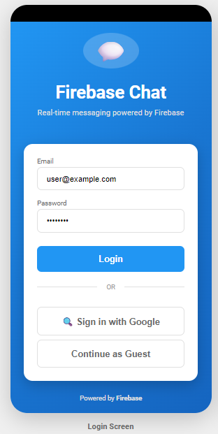
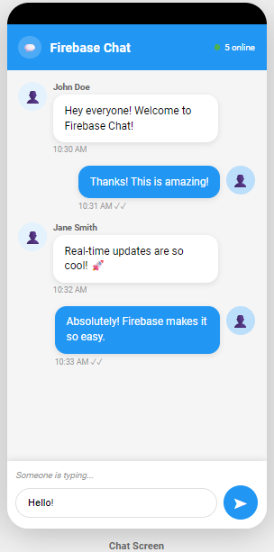
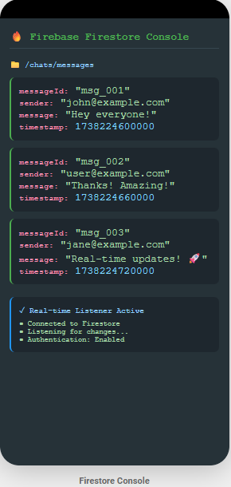

# Firebase-Based Chat Application

## 📱 App Description

A real-time mobile chat application that uses Firebase Authentication for user login and Cloud Firestore for storing and syncing messages instantly across devices.

## 🔐 Firebase Authentication

### Authentication Methods Used

**Email/Password:**
- Users create accounts with email and password
- Firebase handles secure password storage and hashing
- Automatic session management

**Google Sign-In:**
- Quick login using existing Google accounts

**Anonymous:**
- Try the app without creating an account
- Temporary user identity that can be upgraded later

### How Authentication Works

1. User selects login method on login screen
2. Credentials sent to Firebase Authentication
3. Firebase verifies and returns authentication token
4. User redirected to chat with authenticated session
5. Session maintained automatically across app restarts

## 🗄️ Cloud Firestore - How Data is Stored and Retrieved

### Database Structure

```
chats/messages/
├── msg_001
│   ├── sender: "user@example.com"
│   ├── message: "Hello!"
│   ├── timestamp: 1738224600000
│   └── userId: "abc123"
└── msg_002
    ├── sender: "jane@example.com"
    ├── message: "Hi there!"
    ├── timestamp: 1738224660000
    └── userId: "def456"
```

### Storing Messages

1. User types message and clicks send
2. App creates document with sender, message text, timestamp, and userId
3. Document added to Firestore "messages" collection
4. Data instantly uploaded to cloud

### Retrieving Messages

1. App sets up real-time listener on "messages" collection
2. Firestore sends all existing messages
3. When new message arrives, Firestore automatically pushes update
4. UI refreshes instantly without manual reload
5. Works offline - syncs when connection returns

## 📲 Firebase Cloud Messaging (Notifications)

FCM sends push notifications when new messages arrive, even if the app is closed.

**How it works:**
1. App registers with FCM and gets device token
2. Token stored in Firestore linked to user
3. When message sent, cloud function sends notification to recipient's device
4. User receives alert and can open app to respond

## 🔒 Security

Firestore security rules control data access:
- Only authenticated users can read messages
- Users can only send messages with their own userId
- Users can only edit/delete their own messages

## 📸 Screenshots

### 1. Login Screen


Authentication interface with Email/Password, Google Sign-In, and Anonymous options.

### 2. Chat Screen


Real-time messaging with message bubbles, timestamps, and online status.

### 3. Firestore Console


Backend database showing message documents and real-time sync status.

---

## 👨‍💻 Developer
**Patricia Joy C. Relente DIT 3-1**

Mobile Development - Activity 9

Date: January 30, 2026